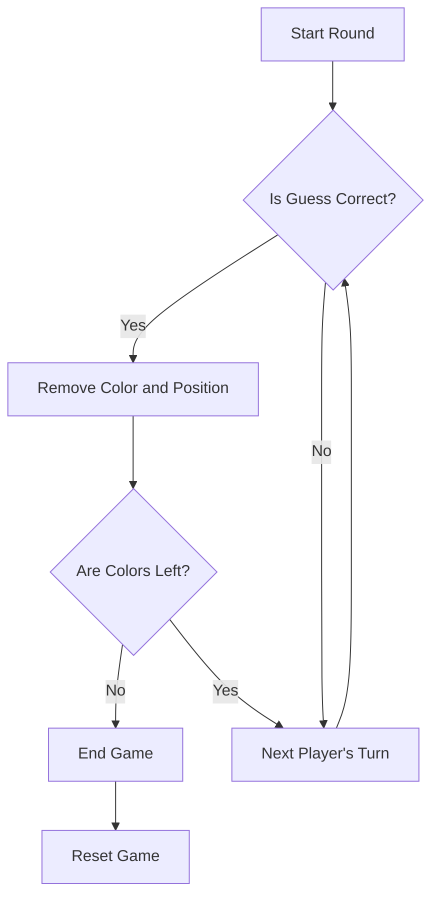

```mermaid
graph TD;
    A[Start Round] --> B{Is Guess Correct?};
    B -- Yes --> C[Remove Color and Position];
    B -- No --> D[Next Player's Turn];
    C --> E{Are Colors Left?};
    E -- No --> F[End Game];
    E -- Yes --> D;
    D --> B;
    F --> G[Reset Game];
    
```
