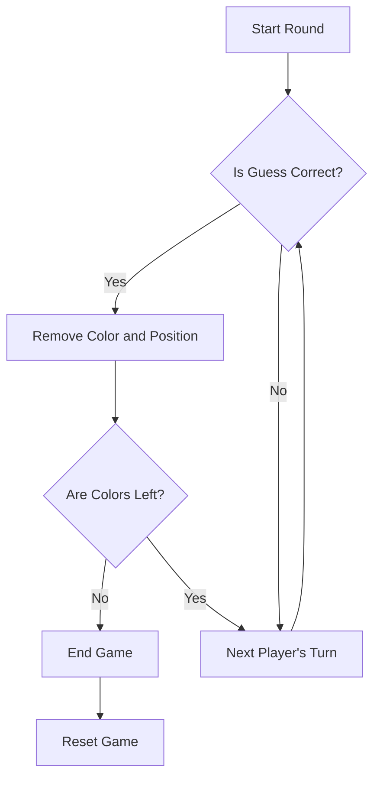
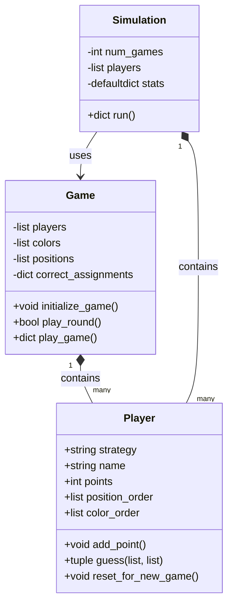

```mermaid
graph TD;
    A[Start Round] --> B{Is Guess Correct?};
    B -- Yes --> C[Remove Color and Position];
    B -- No --> D[Next Player's Turn];
    C --> E{Are Colors Left?};
    E -- No --> F[End Game];
    E -- Yes --> D;
    D --> B;
    F --> G[Reset Game];
    
```

```mermaid
classDiagram
      class Player{
          +string strategy
          +string name
          +int points
          +list position_order
          +list color_order
          +void add_point()
          +tuple guess(list, list)
          +void reset_for_new_game()
      }
      class Game{
          -list players
          -list colors
          -list positions
          -dict correct_assignments
          +void initialize_game()
          +bool play_round()
          +dict play_game()
      }
      class Simulation{
          -int num_games
          -list players
          -defaultdict stats
          +dict run()
      }
      Game "1" *-- "many" Player : contains
      Simulation "1" *-- "many" Player : contains
      Simulation --> Game : uses

```
