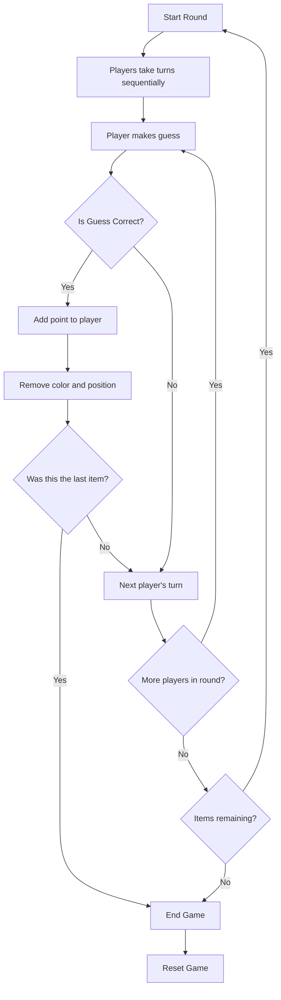
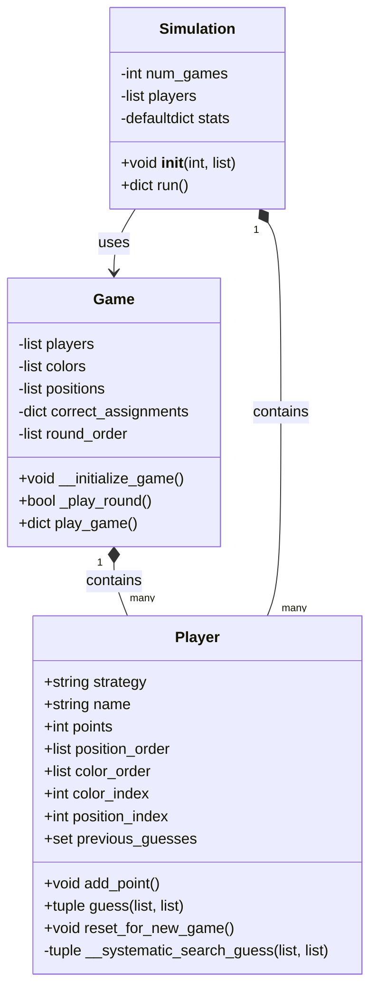

```mermaid
graph TD;
    A[Start Round] --> B[Players take turns sequentially];
    B --> C[Player makes guess];
    C --> D{Is Guess Correct?};
    D -- Yes --> E[Add point to player];
    D -- No --> F[Next player's turn];
    E --> G[Remove color and position];
    G --> H{Was this the last item?};
    H -- Yes --> I[End Game];
    H -- No --> F;
    F --> J{More players in round?};
    J -- Yes --> C;
    J -- No --> K{Items remaining?};
    K -- Yes --> A;
    K -- No --> I;
    I --> L[Reset Game];
    
```

```mermaid
classDiagram
      class Player{
          +string strategy
          +string name
          +int points
          +list position_order
          +list color_order
          +int color_index
          +int position_index
          +set previous_guesses
          +void add_point()
          +tuple guess(list, list)
          +void reset_for_new_game()
          -tuple __systematic_search_guess(list, list)
      }
      class Game{
          -list players
          -list colors
          -list positions
          -dict correct_assignments
          -list round_order
          +void __initialize_game()
          +bool _play_round()
          +dict play_game()
      }
      class Simulation{
          -int num_games
          -list players
          -defaultdict stats
          +void __init__(int, list)
          +dict run()
      }
      Game "1" *-- "many" Player : contains
      Simulation "1" *-- "many" Player : contains
      Simulation --> Game : uses

```
